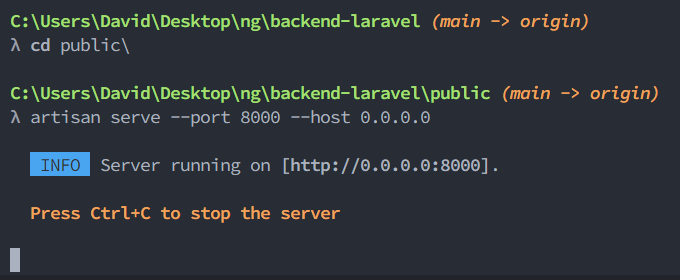

Artisan Root CLI
----

⚙️ A simple CLI script to find and execute the artisan php file in the Laravel project root.

### Description

Normally, you need to `cd` into the project directory in order to run the `./artisan` command.  This is annoying as sometimes you'll need to run artisan from a different folder.

This script allows you to run artisan from any of the subdirectories.

This script works with both **bash** and **cmd.exe**.

## Installation

### Windows
1. `mkdir C:\ProgramData\ArisanRoot & cd mkdir C:\ProgramData\ArisanRoot`
2. `git clone https://github.com/DRSDavidSoft/artisan-root.git .`
3. `systempropertiesadvanced.exe` → <kbd>Environment Variables...</kbd>
 - System Variables → `Path` → <kbd>Edit...</kbd> → <kbd>New</kbd>
 - Enter: `C:\ProgramData\ArisanRoot` → <kbd>OK</kbd> (three times)

### Linux
1. `sudo -i`
2. `cd /usr/local`
3. `git clone https://github.com/DRSDavidSoft/artisan-root.git`
4. `ln -s /usr/local/artisan-root/artisan /usr/local/bin/artisan`

### Demo

### Alternatives
- **[artisan-anywhere](https://github.com/antonioribeiro/artisan-anywhere)**: A bash version of the same tool, by @antonioribeiro
- [A small gist script](https://gist.github.com/jhoff/8fbe4116d74931751ecc9e8203dfb7c4?permalink_comment_id=4445619#gistcomment-4445619), by @sfinktah

### License
Copyright <c> 2022 by David Refoua <David@Refoua.me>
